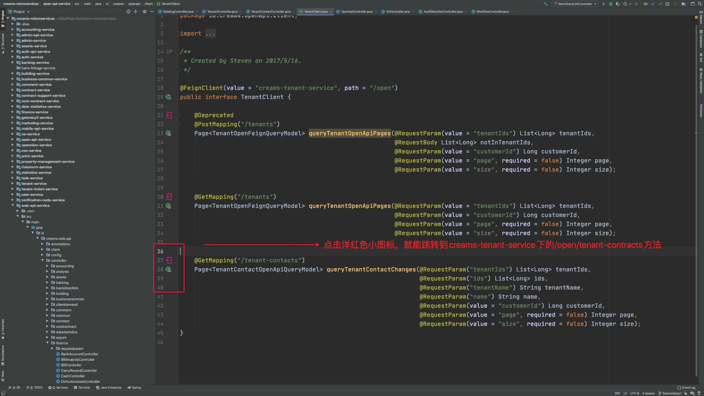
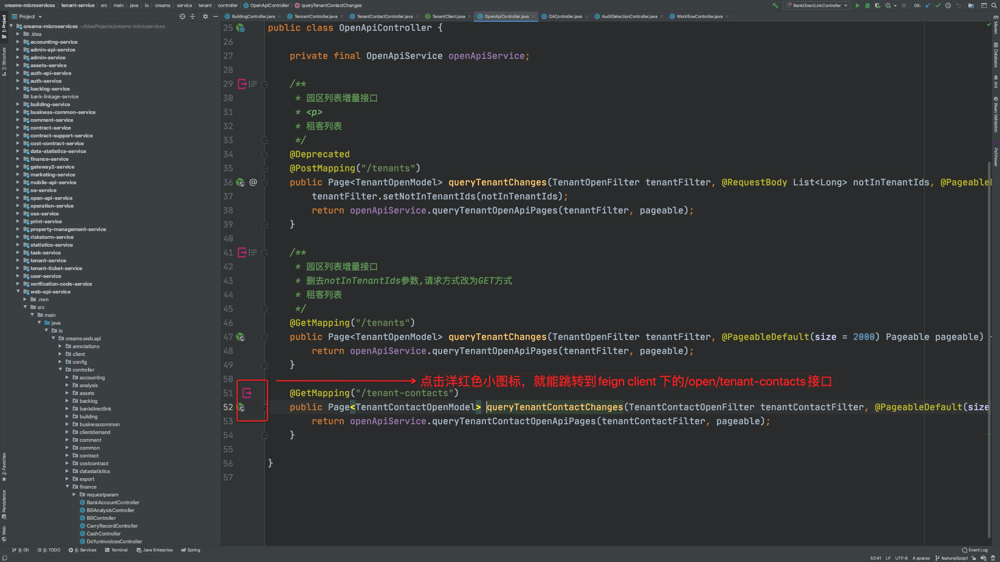

# spring-cloud-feign-switch
使用微服务时，我们会使用feign来调用其他服务的接口。
这个插件用来帮助我们从feign client快速跳转到具体服务的接口。也可以从具体服务的接口跳转到有使用该接口的feign client。

## support version
    - idea-2020.1.2
    
## how to use
```$xslt
    1. 查看对应的idea version
    2. 去release包中找到相应的version
    3. 去idea plugin 找到 insert plugin from disk 导入下载到的release（整个zip导入进去就好了） 
```
## issue
有问题欢迎提issue。

## 使用效果
在feign client中点击深红色小图标，就可以跳转到具体controller中的mapping方法。

在controller中点击深红色小图标，就可以跳转到具体feign client中的mapping方法（如果有多个client，可以进行选择）。
